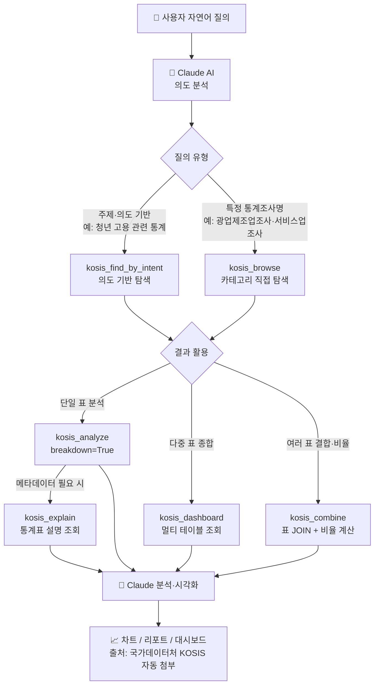

# 📊 KOSIS MCP 서버

KOSIS(국가통계포털) 데이터를 Claude AI가 자동으로 **검색·분석·시각화**해주는 MCP 서버입니다.  
"청년정책 보고서 쓰고 있어, 관련 통계 찾아줘" 같은 자연어 한 마디로 통계 탐색부터 차트 생성까지 한번에 처리합니다.

---

## ✨ 주요 기능

| 기능 | 설명 |
|------|------|
| **의도 기반 검색** | 자연어로 연구 목적을 설명하면 관련 KOSIS 통계표를 자동 탐색 |
| **원스텝 조회** | 표 이름·기간이 명확한 경우 검색과 데이터 조회를 단일 호출로 처리 |
| **데이터 조회** | 통계표 데이터를 조회해 Claude에게 전달 |
| **Claude 자체 시각화** | Claude가 직접 차트를 생성 (꺾은선·막대·파이 등 다양한 형태) |
| **다중 대시보드** | 여러 통계표를 한꺼번에 조회해 대시보드로 시각화 |
| **카테고리 탐색** | 주제별·대상별·이슈별 KOSIS 카테고리 직접 탐색 |
| **멀티유저 지원** | 서버 1개로 여러 사용자가 각자 KOSIS 키를 URL에 붙여 사용 |
| **출처 자동 표시** | 모든 출력(텍스트·표·차트)에 통계표명 + KOSIS URL 자동 첨부 |

---

## 🚀 사용 방법 (3단계)

### 1단계 — KOSIS 인증키 발급

1. [kosis.kr/openapi](https://kosis.kr/openapi/) 접속 후 회원가입
2. **활용신청 → 인증키 발급** 클릭 (즉시 발급)
3. 발급된 인증키 복사

### 2단계 — Claude에 연결

Claude 앱 → **설정** → **커넥터** → **커스텀 커넥터 추가** 클릭  
이름은 자유롭게 입력하고, URL란에 아래 주소(인증키 포함)를 입력 후 추가:

```
https://kosis-mcp-production.up.railway.app/mcp?kosis_key=발급받은_인증키
```

> **서버 홈페이지**: https://kosis-mcp-production.up.railway.app  
> 홈페이지에서 인증키를 입력하면 접속 URL이 자동 생성됩니다.

> 💡 **사내 인터넷망 PC에서도 URL 방식으로 바로 연결 가능합니다.**  
> 사내 SSL inspection 환경에서 Node.js(TypeScript) 기반 MCP는 자체 CA 번들 문제로 URL 연결이 실패하는 경우가 있습니다.  
> 이 서버는 Python + Railway 배포 방식으로, 클라이언트(Claude 앱)가 OS 신뢰 저장소를 통해 Railway의 공인 인증서(Let's Encrypt)로 직접 연결하기 때문에 사내망에서도 별도 설정 없이 URL 방식이 동작합니다.

### 3단계 — Claude에게 말하기

연결 후 Claude에게 바로 자연어로 요청하세요:

```
청년정책 보고서 작성 중인데, 청년 고용·주거 관련 KOSIS 통계 찾아서 분석해줘
```

```
저소득 한부모 가정을 위한 정책 마련 중이야. 관련 통계 차트로 보여줘
```

```
인구 소멸 논문 쓰고 있어. 합계출산율과 고령화율 추이 그래프 만들어줘
```

```
최근 10년간 청년 실업률 꺾은선 그래프로 보여줘
```

정확한 통계 용어를 몰라도 괜찮습니다 — 아래처럼 구어체로 말해도 자동으로 찾아줍니다:

```
아이 안 낳는 이유 관련 자료 찾아줘
```

```
집값 너무 오른 거 보여주는 통계 있어?
```

```
한국 경제 성장 둔화 얼마나 심한지 데이터로 보여줘
```

```
1인 가구 늘어나는 거 분석하려고 통계 찾아줘
```

---

## 💬 이런 것들을 만들 수 있어요

### 📊 인터랙티브 대시보드 (HTML)

> "1인가구 통계 대시보드 만들어줘"

1인가구 비율 추이(2000~2024), 시도별 규모 비교, 취업률 추이 등 여러 통계표를 한 화면에 통합한 HTML 대시보드를 생성합니다. 인터넷 없이도 로컬에서 바로 열리는 단일 파일로 제공됩니다.

---

### 📄 통계 기반 리포트 (HTML / Word)

> "대한민국 자살 통계 2005~2024 리포트 만들어줘"

"하루 40.7명, 돌아오지 않은 사람들" 같은 임팩트 있는 헤드라인부터 20년 추이 분석, 성별·연령별 세분류, 지역별 비교까지 서술형 리포트로 구성합니다. Word(.docx) 또는 HTML 형태로 저장 가능합니다.

---

### 🗺 지역 상권 분석 보고서

> "대전 서구 삼겹살 가게 시장 포화도 분석해줘"

사업체 수 추이, 신생률, 폐업률 등 KOSIS 사업체 통계를 활용해 특정 지역·업종의 시장 현황을 분석한 보고서를 생성합니다. 시군구 단위 데이터를 정확히 식별해 전국 동일 지명 오매칭 없이 추출합니다.

---

### 기타 활용 예시

| 요청 | 출력 형태 |
|------|-----------|
| "청년 고용·주거 관련 통계 찾아줘" | 관련 통계표 목록 + KOSIS 링크 |
| "합계출산율 2000년부터 꺾은선 그래프" | 인터랙티브 차트 |
| "시도별 고령화율 비교 막대 그래프" | 차트 + 수치 요약 |
| "저출산 관련 정책 보고서용 통계 모아줘" | 다중 통계표 대시보드 |

---

## 🗂 지원 연구·정책 분야

자연어 질의에 아래 키워드가 포함되면 관련 통계를 자동으로 탐색합니다.

**대상별**: 청년 · 아동·보육 · 청소년 · 노인·고령자 · 여성 · 장애인 · 다문화 · 한부모

**이슈별**: 저출산·저출생 · 고령화 · 인구소멸 · 1인가구·독거 · 저소득·빈곤

**주제별**: 고용·실업 · 교육 · 주거·주택·집값 · 소득·임금 · 복지·국민연금 · 보건·의료 · 인구 · 제조업·광공업 · 산업 · 농림어업 · 무역·수출입 · 물가 · 에너지 · 국민계정(GDP·GNI·성장률) · 환경 · 건설 · 프랜차이즈 · 소상공인

**지역통계**: 시도·시군구 지역통계 · e-지방지표

**기관별**: 국가데이터처 · 국토교통부 · 보건복지부 · 교육부 · 고용노동부 등 기관명 직접 검색

> 💡 **정확한 통계 용어를 몰라도 됩니다.** "집값", "아이 안 낳는", "경제 성장 둔화", "1인 가구" 등 구어체 표현도 자동으로 인식합니다.

---

## ⚙️ MCP 도구 목록

| 도구 | 설명 |
|------|------|
| `kosis_find_by_intent` | 자연어 의도 → 관련 통계표 자동 탐색 + KOSIS 직접 링크 제공 |
| `kosis_browse` | KOSIS 카테고리 트리 직접 탐색 (특정 통계조사 접근 시 권장) |
| `kosis_analyze` | 통계 데이터 조회 후 Claude에게 전달 (Claude가 차트 생성) |
| `kosis_dashboard` | 여러 통계를 한꺼번에 조회 (Claude가 대시보드로 시각화) |
| `kosis_combine` | 여러 표 데이터를 연도 기준으로 결합·비율 계산 |
| `kosis_explain` | 통계표 조사 목적·주기·대상 범위 조회 |

### 도구 선택 기준

| 사용자 요청 | 선택 도구 | 이유 |
|-------------|-----------|------|
| "저출산 관련 통계 뭐가 있어?" | `kosis_find_by_intent` | 주제 기반 → 자동 탐색 |
| "광업제조업조사 사업체수·출하액" | `kosis_browse` (L_5) | 고유 조사명 → 카테고리 직접 탐색 |
| "서비스업조사 매출액 5년치" | `kosis_browse` (O_8) → `kosis_analyze` | 조사명 + 데이터 조회 |
| "청년 고용·주거 대시보드" | `kosis_find_by_intent` → `kosis_dashboard` | 다중 표 종합 |
| "이 통계표 어떤 조사야?" | `kosis_explain` | 메타데이터 조회 |

---

## 🔀 전체 처리 흐름



> 특정 통계조사명(광업제조업조사·서비스업조사 등)은 `kosis_browse`로 카테고리를 직접 탐색하는 것이 가장 정확합니다.  
> 주제·의도 기반 탐색에는 `kosis_find_by_intent`, 데이터 조회에는 `kosis_analyze(breakdown=True)`를 사용하세요.

---

## 🔧 핵심 개선 이력

초기 버전 이후 실사용 과정에서 발견된 문제들을 지속 개선해왔습니다.

### 표 구조 자동 탐지

기존에는 표마다 차원 구조(objL 파라미터)를 수동으로 파악해야 했습니다.  
`_probe_table_params`가 표를 호출하기 전에 차원 수·수록 주기(연/월/분기)를 자동 탐지하도록 개선했습니다.  
→ 어떤 통계표든 별도 설정 없이 바로 조회 가능

### 수록 주기 자동 감지

연간(Y) / 월간(M) / 분기(Q) 여부를 사전에 알 수 없는 표가 다수 존재합니다.  
→ Y → M → Q 순서로 자동 시도해 올바른 주기를 찾아 데이터 조회

### 40,000셀 제한 자동 처리

KOSIS OpenAPI는 **1회 요청당 최대 40,000셀**을 반환합니다. 셀 수 = 차원값 수 × 기간 수이므로, 차원이 많은 표에서 초과가 발생합니다.  
→ 초과(err 31) 시 조회 기간을 자동으로 절반씩 단축하며 최대 3회 재시도  
→ 기본 조회 시 각 차원의 합계("계") 코드만 사용해 셀 수를 최소화  
→ `breakdown=True` 옵션으로 성별·연령별 세분류 조회 가능 (셀 수 증가 유의)

> ⚠️ **조회 제한 안내**: 차원이 매우 많은 통계표(예: 사망원인 104항목 × 성별 × 연령 5세 구간)는  
> 40,000셀 한계로 인해 전체 세분류 조회가 불가할 수 있습니다.  
> 이 경우 `filter_keyword`로 특정 항목만 추출하거나 `breakdown=False`(기본값)로 합계 데이터를 조회하세요.

### 지역명 중복 자동 해소

"서구", "중구", "남구"처럼 전국에 동일 이름이 여럿인 행정구역은 오매칭 가능성이 있습니다.  
→ `filter_keyword`에 공백 포함 입력 시 **자동 AND 분해**  
예) `"대전 서구"` → 대전 AND 서구 → 대전광역시 서구만 추출

### 출처 자동 표시

모든 조회 결과에 통계표명과 KOSIS 직접 링크가 자동으로 포함됩니다.

| 출력 형식 | 출처 표시 방식 |
|-----------|----------------|
| 텍스트·요약·분석 | 응답 하단에 `출처: 국가데이터처 KOSIS 「표명」` + URL |
| 표(table) | 표 하단에 citation + KOSIS URL |
| 차트·대시보드 | 차트 footer에 citation 표시 (URL 생략) |

### 응답 페이로드 경량화

Claude와 MCP 서버 간 토큰 소비를 실측 기반으로 최소화했습니다.

| 개선 항목 | 변경 내용 | 효과 |
|-----------|-----------|------|
| JSON compact 출력 | `indent=2` → `separators=(',',':')` | 응답 크기 ~40% 감소 |
| `UNIT_NM` 행별 제거 | 각 행 반복 포함 → 최상위 `unit` 필드 단일 반환 | 데이터 배열 ~15% 감소 |
| `recent_n` 기본값 축소 | 20 → 10 | 기본 데이터 절반 |
| `kosis_analyze` data cap | 100행 → 60행 | 데이터 배열 40% 감소 |
| `kosis_dashboard` sample | 5행 샘플 → 25행 data | Claude의 추가 `kosis_analyze` 호출 방지 |

### 인텐트 매핑 개선 — 오매칭 수정 및 분야 확장

실사용 중 발견된 잘못된 카테고리 매핑을 수정하고, 지원 분야를 확장했습니다.

**오매칭 수정**:

| 오매칭 사례 | 원인 | 수정 |
|-------------|------|------|
| "제조업통계" → 인구통계 | "이동"·"사망" 등 2글자 토큰이 인구 인텐트를 잘못 트리거 | 2글자 범용 토큰 제거, 복합어로 대체 |
| "국민연금 수급자" → 미감지 | 연금 관련 키워드 누락 | "국민연금"·"기초연금" 복지 인텐트에 추가 |
| "gdp 성장률" → 미감지 | 대문자 "GDP" 키워드가 소문자 쿼리에 불일치 | 영문 키워드 전면 소문자화 + 대소문자 무관 비교 |

**신규 인텐트 추가**: 제조업 · 산업 · 농림어업 · 무역 · 물가 · 에너지 · 국민계정(GDP/GNI) · 환경 · 건설 (9개)

### 구어체·모호 질의 대응 강화

사용자들은 정확한 통계 용어 대신 구어체로 질의하는 경우가 많습니다.  
실제 사용 패턴을 분석해 다음 케이스를 추가 처리합니다.

| 구어체 질의 | 인식 인텐트 |
|-------------|------------|
| "아이 안 낳는 이유 관련 자료" | 저출산 |
| "집값 너무 오른 거 보여주는 통계" | 주거·주택 |
| "한국 경제 성장 둔화 얼마나 심한지" | 국민계정 |
| "1인 가구 늘어나는 거 분석하려고" | 1인가구 |
| "독거노인 통계" | 1인가구 |
| "저출생 문제 데이터" | 저출산 |
| "경기침체 관련 통계" | 국민계정 |

공백 포함 문자열("경제 성장", "1인 가구")을 키워드로 등록해 어절 경계를 넘는 substring 매칭을 지원합니다. 2글자 토큰은 단어 단위 정확 매칭으로 복합어 오매칭을 방지합니다.

### 한국어 조사 자동 제거

검색어 토큰에서 이/가, 을/를, 은/는, 의, 로 등 35개 조사를 자동 인식 및 제거합니다.  
→ "아이가", "집값이", "제조업의" 등 조사 결합 구어체에서도 키워드 매칭 정상 동작

### 분리된 시계열 자동 병합

KOSIS는 통계 작성방식이 바뀌면 기존 표를 유지하고 새 표를 별도로 생성합니다.  
예) 서비스업조사: "10차 산업분류 개정(2020~)"과 "11차 서비스업조사(2023~)"가 형제 카테고리로 분리.  
→ `kosis_browse`가 `(YYYY~)` 패턴 형제 카테고리를 자동 감지해 `methodology_split: true` 마킹  
→ `kosis_analyze`의 `extra_tbl_ids` 파라미터로 이전 방법론 표를 병합 조회  
→ 응답에 `coverage` 필드(실제 시계열 범위)와 `merged_tables` 필드(병합 표 목록) 포함  
→ 중복 연도는 주 표(`tbl_id`) 데이터 우선 적용

### 카테고리 직접 탐색 — `kosis_browse`

`kosis_find_by_intent`가 고유 조사명(광업제조업조사·서비스업조사 등)에서 적중률이 낮은 문제를 해결하기 위해, 카테고리 코드를 직접 지정해 트리를 탐색하는 방식을 권장합니다.

**주요 카테고리 코드 (MT_ZTITLE 기준)**:

| 코드 | 해당 조사 |
|------|-----------|
| `L_5` | 광업제조업조사 (사업체수·종사자수·출하액) |
| `O_8` | 서비스업조사 (도소매·숙박·음식·서비스업 매출액) |
| `I` | 기업·산업 전반 |
| `Q` | 국민계정·경기·기업경영 |
| `A` | 인구·가구 / `C` 노동·임금 / `F` 보건·의료 |

트리를 끝까지 내려간 뒤 이름에 **"총괄"·"주요지표"** 가 포함된 표를 선택하고, 분류 개정으로 표가 분리된 경우 `kosis_analyze`의 `extra_tbl_ids`로 이전 표를 병합해 연속 시계열을 구성합니다.

### 내부 로직 개선

순수 코드 품질·정확성 개선으로, 사용자에게 노출되는 기능 변화 없이 안정성을 향상시켰습니다.

- **`filter_keyword` 사전 필터링 버그 수정**: 지역명 필터 적용 시 내부 데이터 전처리 순서 문제로 결과가 비는 버그 수정 — 이제 필터링을 원본 데이터에 먼저 적용
- **중복 제거 O(n²) → O(1) 개선**: 검색 결과 중복 제거 로직을 리스트 선형탐색에서 해시 집합(set)으로 변경
- **정규식 모듈 레벨 이동**: 매 요청마다 재컴파일되던 정규식을 모듈 상수로 이동
- **기관명 자동 변환**: KOSIS 데이터의 "통계청" → "국가데이터처" 자동 변환 (2025년 기관명 변경 반영)
- **표 식별자 비노출**: `tbl_id`, `org_id` 등 내부 식별자는 사용자에게 노출하지 않고 통계표명으로만 안내

---

## 🏗 프로젝트 구조

```
kosis-mcp/
├── server.py          # MCP 서버 (Streamable HTTP, 6개 도구: find_by_intent·browse·analyze·dashboard·combine·explain)
├── kosis_client.py    # KOSIS OpenAPI �